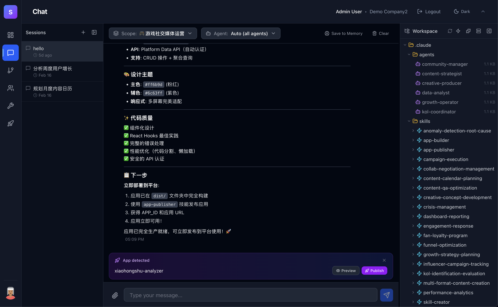
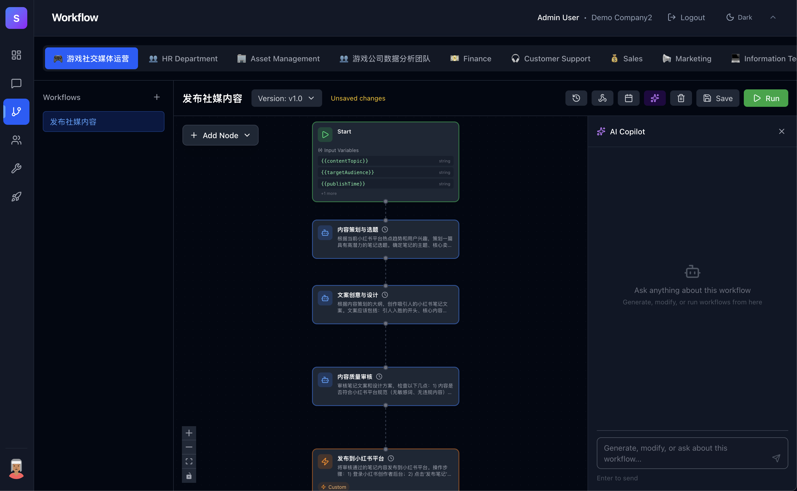

# Super Agent

[](LICENSE)
[](https://www.typescriptlang.org/)
[](https://react.dev/)
[](https://nodejs.org/)
[](https://aws.amazon.com/bedrock/)
[](CONTRIBUTING.md)

**让企业的每一个业务流程都拥有自己的 AI 员工。**

Super Agent 是一个企业级多智能体平台，帮助企业将业务知识沉淀为标准化 SOP，再从 SOP 中孵化出能自主执行任务的虚拟员工（AI Agent）。通过可视化工作流将多个智能体串联协作，企业可以像搭积木一样构建自动化业务流程——无需写代码，无需改造现有系统。

---

## 产品定位

### 现有方案的困境

传统 RPA 软件只能处理结构化、规则明确的任务，实施一套业务流程需要专业开发团队逐步配置每个节点、每条规则，耗时数周甚至数月。Dify、Coze 等新一代工作流平台虽然引入了 AI 能力，但本质上仍是"技术人员搭建、业务人员使用"的模式——每个节点需要精确配置 API 参数、数据映射和条件表达式，业务人员无法独立完成。

更大的问题在于：一旦工作流固化上线，业务需求变化时，修改和演进的成本几乎等同于重新实施。企业不得不持续投入高昂的技术人力来维护这些"僵化"的流程。

### Super Agent 的不同

Super Agent 是一个现代化的企业级多租户智能体平台，让非技术人员也能直接上手：

- **SOP 驱动**：业务人员导入现有 SOP 文档，或通过自然语言让智能体自动生成 SOP，再从 SOP 一键孵化出完整的工作流——无需配置任何技术参数
- **低实施成本**：节点用自然语言描述意图（如"在 CRM 中创建商机"），而非手动配置 URL、Headers、Body，大幅降低搭建和修改门槛
- **自主演进**：基于记忆体（Memory）机制，智能体在执行任务的过程中持续积累经验，自主优化决策和行为，让系统越用越聪明，而非越用越僵化

Super Agent 的核心理念：

> **定义业务 → 创造智能体 → 固化工作流 → 持续进化**

企业通过业务域（Business Scope）划分业务领域（销售、HR、IT 运维等），在每个领域内定义专属的知识库、SOP 和工具集，然后创建具备这些能力的 AI Agent。多个 Agent 通过 Workflow 协同工作，形成可复用、可监控、可自主迭代的智能业务流水线。

---

## 核心价值

### 🧠 从经验到资产：业务知识不再流失
企业最宝贵的资产是沉淀在老员工脑中的业务经验。Super Agent 通过业务域（Business Scope）+ 知识库体系，将散落的经验文档、SOP、最佳实践转化为 AI 可理解的结构化知识，让每一个新创建的智能体都站在"老员工"的肩膀上。

### 🤖 从 SOP 到虚拟员工：一键孵化 AI 团队
业务人员导入 SOP 或用自然语言描述业务场景，系统自动生成具备专业能力的 AI Agent——拥有独立的角色定义、技能包和工具权限，就像招聘了一个已经培训好的专业员工。

### 🔗 从单兵到协作：工作流串联多智能体
单个 Agent 能力有限，但通过可视化 Workflow Editor，可以将多个 Agent 编排成完整的业务流程。支持定时触发、Webhook 触发、条件分支，让复杂的跨部门协作自动运转。

### 🧩 从封闭到开放：无限扩展的能力边界
通过 Skills 市场、MCP（Model Context Protocol）工具连接器和 OpenAPI Spec 自动转 Skill，Agent 可以无缝接入企业现有工具链，能力边界随接入系统的增加而持续扩大。

### 💬 从工具到产品：Chat 即 Mini-SaaS
在对话中用自然语言生成 Mini-SaaS 应用，并发布到企业应用市场，让非技术人员也能一键使用 AI 能力——Chat 本身就是一个应用构建器。

---

## 功能概览

Super Agent 的所有能力围绕两个核心交互范式展开：

### 💬 Chat：与 AI 员工实时对话

Chat 是用户与 Agent 最直接的交互方式——像和同事对话一样，向 AI 员工提问、下达指令、协作完成任务。

| 能力 | 说明 |
| --- | --- |
| **实时对话** | 流式输出、会话恢复、多轮上下文保持 |
| **工作区自动配置** | 每次对话自动加载 Agent 的技能包、知识库和工具链，Agent 开箱即用 |
| **多渠道触达** | 不止 Web 界面——支持 Slack、钉钉、飞书等 IM 渠道直接对话（详见外部系统集成） |
| **Chat 即 Mini-SaaS** | 在对话中用自然语言生成 Mini-SaaS 应用，并发布到企业应用市场，非技术人员也能一键使用 |



### 🔗 Workflow：多 Agent 协作的自动化流水线

Workflow 是 Chat 的升级——当一个任务需要多个 Agent 按流程协作时，用可视化工作流将它们串联起来。

| 能力 | 说明 |
| --- | --- |
| **可视化 DAG 编辑器** | 拖拽式构建，支持 Agent、Action、Condition、Document、Code 等节点类型 |
| **Agentic 执行引擎** | 整个 Workflow 由单一 AI 会话驱动，保持全程上下文，节点是规划构件而非执行单元 |
| **Workflow Copilot** | 用自然语言描述业务流程，AI 自动生成 Workflow 计划，支持多轮对话迭代修改 |
| **触发机制** | 定时触发、Webhook 触发、手动触发，让业务流程按需或自动运转 |
| **执行追溯** | 实时进度可视化、执行历史记录、节点级状态追踪 |



### 🧩 围绕双核心的扩展能力

以下能力同时服务于 Chat 和 Workflow，为 Agent 提供知识、技能和运行环境：

| 能力 | 说明 |
| --- | --- |
| **Business Scope（业务域）** | 按业务领域划分独立环境，隔离知识、技能、工具和权限 |
| **Agent 管理** | 创建和配置 AI 智能体，定义角色、系统提示词、模型参数和技能组合 |
| **Skills 市场** | 可复用的技能包（含 API Spec 自动转 Skill），支持 Scope 级和 Agent 级两层绑定 |
| **MCP 集成** | 通过 Model Context Protocol 标准化接入外部工具（详见外部系统集成） |
| **Knowledge 知识库** | 基于 RAG 的文档管理，为每个 Scope 提供专属知识检索能力 |
| **应用市场** | 将 Agent 能力封装为内部应用，发布、评分、一键运行 |
| **Briefing 智能简报** | 定时生成业务范围简报，自动汇总关键信息 |
| **多租户 & 开发者工具** | 组织级隔离、角色权限、API Key、Webhook、审计日志 |

---

## 外部系统集成

Super Agent 提供多种方式将 Chat 和 Workflow 与企业现有系统打通：

### 入口侧：让外部事件触发 Agent

- **IM 渠道接入**：内置 Slack、Discord、Telegram、钉钉、飞书五大平台适配器，企业员工可以直接在日常使用的聊天工具中与 Agent 对话，消息自动路由到对应的 Business Scope 和会话，走的是和 Web 端完全相同的 Chat 处理链路
- **Webhook 触发**：为 Workflow 创建专属 Webhook 端点，外部系统（如 CRM、工单系统、CI/CD 流水线）通过 HTTP 调用即可触发工作流执行，支持传入变量参数和签名验证
- **定时调度**：基于 Cron 表达式的定时触发，支持时区配置，适用于日报生成、定期数据同步、周期性巡检等场景
- **OpenAPI 调用**：提供标准化的 REST API（API Key 鉴权），外部系统可通过编程方式触发 Workflow 执行、查询执行状态、获取执行结果和中止执行

### 出口侧：让 Agent 调用外部系统

- **OpenAPI Spec 自动转 Skill**：上传 OpenAPI/Swagger 规范文件（JSON 或 YAML），系统自动解析端点、参数、认证方式，生成 Scope 级共享技能。Agent 在对话或工作流中可直接使用这些技能调用外部 API，无需手动配置
- **MCP 工具连接器**：通过 Model Context Protocol 标准化接入 40+ 外部工具（Salesforce、Jira、Slack、企业微信等），每个连接器可绑定到 Business Scope，所有该域内的 Agent 自动获得调用能力

---

## 企业级可观测性与审计

作为面向企业的多租户多角色智能体系统，Super Agent 在设计上充分考虑了企业级软件审计和运维可观测性的需要：

- **全链路追踪**：集成 Langfuse 可观测性平台，每次对话自动记录完整的 Agent 推理过程、工具调用链和子 Agent 委派记录，支持按会话、用户、Agent 维度回溯，做到"每一步都可解释"
- **智能体活动指标**：实时捕获子 Agent 调用、Skill 使用、工具调用、错误等关键事件，自动聚合为日度指标汇总，支持按 Agent、时间范围查询活动趋势，让管理者清晰掌握每个智能体的工作量和健康状态
- **Workflow 执行审计**：每次工作流执行全程留痕，每个节点的状态流转（等待 → 执行中 → 完成/失败）均可追溯，支持执行历史查询和错误定位
- **请求级日志**：每个操作自动生成唯一追踪标识，贯穿完整调用链路，便于问题排查和跨系统关联
- **多租户数据隔离**：所有数据（对话、执行记录、指标、事件）严格按组织隔离，确保租户间数据不可见

---

## Tech Stack

| Layer          | Technology                                                        |
| -------------- | ----------------------------------------------------------------- |
| Backend        | Fastify, TypeScript, Prisma ORM, PostgreSQL, Redis (BullMQ)      |
| Frontend       | React 19, Vite, TypeScript, Tailwind CSS, React Router, XY Flow  |
| AI             | Amazon Bedrock (Claude), Claude Agent SDK, Langfuse observability |
| Storage        | AWS S3 (documents, avatars, skills)                               |
| Auth           | AWS Cognito                                                       |
| Infrastructure | AWS CDK (EC2, Aurora Serverless v2, S3, Cognito, CloudWatch)      |
| Containerization | Docker, Docker Compose                                          |

## Prerequisites

- Node.js >= 18
- Docker & Docker Compose
- AWS account with Bedrock access (Claude models)
- PostgreSQL 15+ (or use Docker Compose)
- Redis 7+ (or use Docker Compose)

## Getting Started

### 1. Clone the repository

```bash
git clone <repository-url>
cd super-agent
```

### 2. Backend Setup

```bash
cd backend
cp .env.example .env
# Edit .env with your configuration
npm install
npx prisma generate
npx prisma migrate dev
npm run dev
```

The backend runs on `http://localhost:3000` by default.

### 3. Frontend Setup

```bash
cd frontend
cp .env.example .env
# Edit .env with your configuration
npm install
npm run dev
```

The frontend runs on `http://localhost:5173` by default.

## License

AGPL-3
