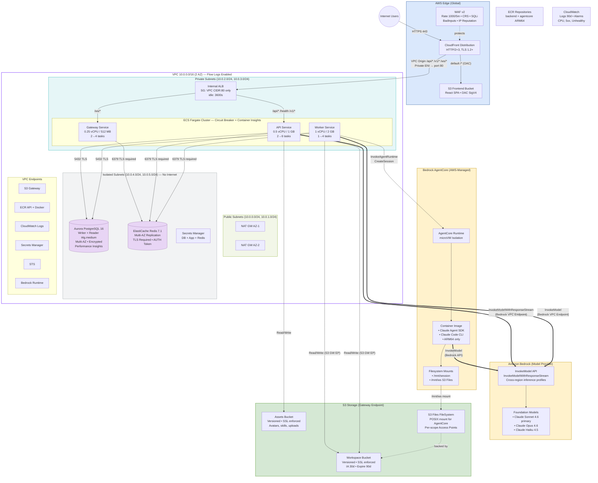

# Super Agent — Production Architecture

> Updated: 2026-06-04 | Based on `infra/` CDK constructs (current branch)

## Architecture Diagram (Mermaid)



## Component Summary

### Network (VPC)

| Layer | CIDR | Purpose |
|-------|------|---------|
| Public | 10.0.0.0/24, 10.0.1.0/24 | NAT Gateways (2x, HA) |
| Private | 10.0.2.0/24, 10.0.3.0/24 | ECS Fargate + Internal ALB |
| Isolated | 10.0.4.0/24, 10.0.5.0/24 | Aurora PostgreSQL + Redis (no internet) |

**VPC Endpoints (7):** S3 Gateway, ECR API, ECR Docker, CloudWatch Logs, Secrets Manager, STS, **Bedrock Runtime**

### Compute (ECS Fargate)

| Service | CPU/Mem | Scale | Role |
|---------|---------|-------|------|
| API | 0.5 vCPU / 1 GB | 2→6 | HTTP API, chat streaming |
| Worker | 1 vCPU / 2 GB | 1→4 | BullMQ jobs, workflow execution, AgentCore orchestration |
| Gateway | 0.25 vCPU / 512 MB | 2→4 | WebSocket, IM long-lived connections |

### AI / Model Layer

| Component | Purpose | Access Pattern |
|-----------|---------|---------------|
| **Amazon Bedrock** | Foundation model provider | VPC Endpoint (private) |
| Claude Sonnet 4.6 | Primary model (chat + workflows) | `InvokeModelWithResponseStream` |
| Claude Opus 4.6 | Complex reasoning tasks | `InvokeModel` |
| Claude Haiku 4.5 | Fast/cheap tasks | `InvokeModel` |
| Cross-region profiles | Global model routing | `us.anthropic.*` prefix |
| **Bedrock AgentCore** | Isolated agent execution runtime | `InvokeAgentRuntime` from Worker |

### Model Invocation Paths

```
Path A: Direct (Chat Streaming)
  ECS API/Worker → Bedrock Runtime VPC Endpoint → Claude Models → Stream back

Path B: AgentCore (Autonomous Workflows)
  ECS Worker → AgentCore Runtime → microVM Container
    → Claude Agent SDK → Bedrock API → Claude Models
    → Read/Write workspace on S3 Files mount (/mnt/ws)
```

Both paths use:
- `CLAUDE_CODE_USE_BEDROCK=1` environment variable
- Cross-region inference profiles for availability
- IAM least-privilege with `SourceAccount` condition

### Data Layer

| Service | Config | Access |
|---------|--------|--------|
| Aurora PostgreSQL 16 | Writer + Reader (t4g.medium), Multi-AZ, encrypted, Performance Insights | ECS→5432 only |
| ElastiCache Redis 7.1 | Replication group, Multi-AZ, TLS required, AUTH token | ECS→6379 only |
| Secrets Manager | DB creds, App secret (JWT), Redis AUTH | VPC Endpoint |

### Storage (S3)

| Bucket | Purpose | Features |
|--------|---------|----------|
| Workspace | Agent workspaces, S3 Files backing store | Versioned, lifecycle (IA 30d, expire 90d) |
| Assets | Avatars, skills, uploads | Versioned, enforceSSL |
| Frontend | React SPA (CloudFront origin) | OAC SigV4, enforceSSL |
| S3 Files FileSystem | POSIX filesystem for AgentCore | Per-scope access points |

### Edge / CDN

| Component | Config |
|-----------|--------|
| CloudFront | HTTP/2+3, TLS 1.2+, VPC Origin → internal ALB |
| WAF v2 | Rate limit 1000/5m, CRS, SQLi, BadInputs, IP Reputation |
| S3 Frontend | BucketDeployment with cache control (immutable assets, no-cache index.html) |

### Security Posture

- **Network:** No 0.0.0.0/0 ingress, VPC Origin (private path), 7 VPC Endpoints, Flow Logs
- **IAM:** Least-privilege S3 actions, SourceAccount conditions, no wildcard policies
- **Encryption:** TLS 1.2+ everywhere, Redis TLS required, S3 enforceSSL, RDS encrypted at rest
- **WAF:** Rate limiting, AWS managed rule sets (CRS, SQLi, BadInputs, IP Reputation)
- **Reliability:** Circuit breaker + rollback, graceful shutdown 120s, Multi-AZ all layers
- **Observability:** Container Insights, CloudWatch Logs (90d), Alarms (CPU, 5xx, unhealthy hosts)
