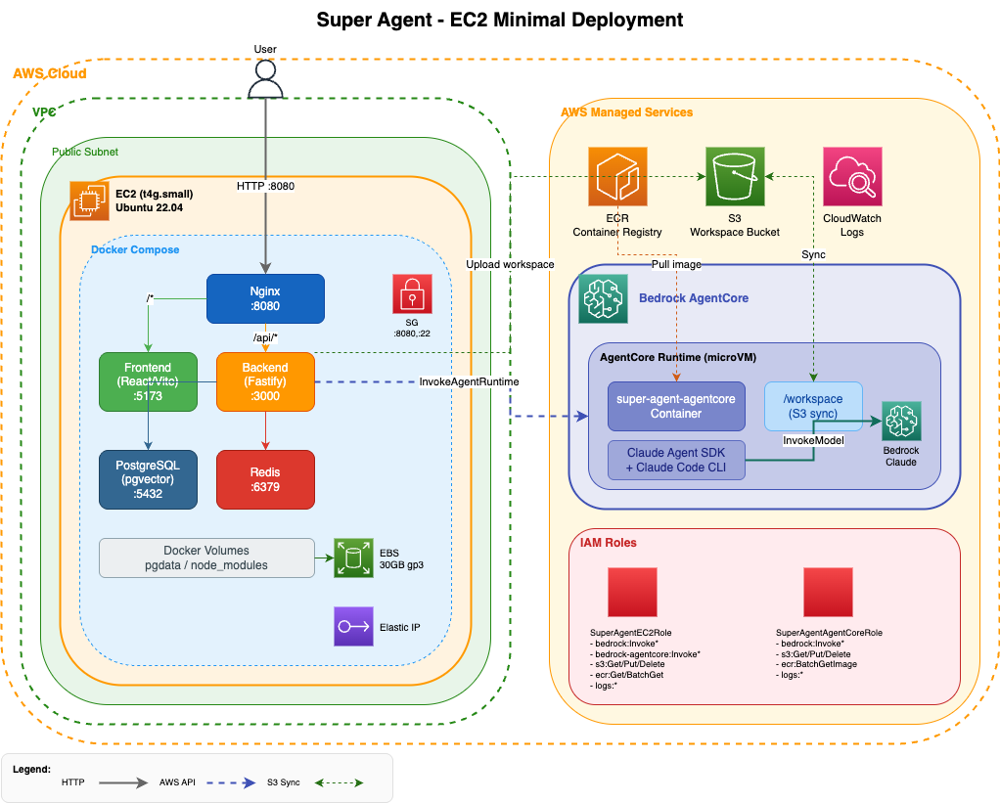

# Super Agent 内部分享

---

## What — Super Agent 是什么

Super Agent 是一个企业级多智能体平台，核心使命：**将业务知识转化为能自主执行任务的 AI 员工**。

核心流程：

```
业务领域 → SOP 文档 → AI Agent → 工作流自动化 → 持续进化
```

它不是一个"套壳 Claude Code"，也不是一个传统的 RPA/工作流引擎。它是一个让 AI Agent 拥有**真实工作环境**的平台——每个 Agent 都有自己的工作目录、技能包、工具链和记忆体，像一个真正的员工一样工作。

**关键能力一览：**

| 能力 | 说明 |
|------|------|
| 多租户业务域 | 按业务领域（销售、HR、IT）隔离知识和权限 |
| AI Agent | 可配置角色、技能、工具的智能体 |
| DAG 工作流 | 多 Agent 协作的可视化自动化流水线 |
| MCP 工具集成 | 通过 Model Context Protocol 连接任意外部系统 |
| Mini-SaaS 构建 | 对话中生成应用，发布到企业市场 |
| 多通道 IM | Slack / 钉钉 / 飞书 / Discord / Telegram |

---

## Why — 为什么要做 Super Agent

### 现有方案的根本问题

| 方案 | 问题 |
|------|------|
| 传统 RPA (UiPath, Blue Prism) | 只能处理结构化规则，实施成本高，修改等于重做 |
| 工作流平台 (Dify, Coze, n8n) | 本质仍是"程序员搭建 → 业务使用"，每个节点需配置 API 参数和数据映射 |
| 直接用 LLM API | 没有持久化、没有工具、没有隔离，无法支撑企业级场景 |

**核心矛盾：** 企业最宝贵的资产（员工脑中的业务经验）在流失，而现有工具无法低成本地将这些经验转化为可执行的自动化。

### Super Agent 的答案

> 让业务人员用自然语言定义"做什么"，让 AI Agent 自己搞定"怎么做"。

不同于传统平台的"配置驱动"，Super Agent 采用"意图驱动"——工作流节点只需写"在 CRM 中创建一条商机"，Agent 会根据自己的技能和工具自主完成执行。

---

## How — 怎么做到的

Super Agent 的技术架构围绕两个核心理念构建：**AI Native** 和 **Cloud Native**。

### 架构总览



---

### 理念一：AI Native — Agent 不是调 API，是给它一个工作环境

"AI Native"不是把 LLM 当成一个 HTTP 接口来调用。它意味着整个系统的架构、数据流、隔离模型都围绕"Agent 是一等公民"来设计。

#### 1. 工作区隔离（Workspace Isolation）

每个 Agent 会话启动时，系统为它准备一个完整的工作目录：

```
/workspace/{sessionId}/
├── CLAUDE.md              # 任务上下文和指令
├── .claude/
│   └── settings.json      # MCP servers, permissions
├── skills/                # 加载的技能定义
└── plugins/               # Git-cloned 插件
```

这不是"传个 prompt 进去"——这是给 Agent 一个真实的文件系统工作环境。Agent 可以读写文件、运行代码、使用工具，就像一个人坐在电脑前工作。

#### 2. Claude Agent SDK 作为运行时核心

Agent 的执行不是简单的 API 调用 → 解析响应 → 下一步。而是启动一个完整的 Claude Agent SDK 会话：

```
用户消息 → 加载 Workspace → Claude Agent SDK 接管
                                  ↓
                          自主规划 → 调用工具 → 读写文件
                                  ↓
                          流式输出 → 持久化 → 记忆沉淀
```

Agent 拥有自主决策能力：它会根据 workspace 中的技能定义和 MCP 工具，自己决定调用什么、怎么调用、调用几次。

#### 3. 技能（Skills）作为一等公民

Skills 不是"function calling 的 JSON schema"。它们是结构化的 Markdown 文档，包含：
- 能力描述
- 执行策略
- 约束条件
- 输出格式

Agent 读取 Skill 后，能理解"我在什么场景下该用这个能力"以及"用的时候要注意什么"。

#### 4. MCP 协议 — 标准化的工具接入

通过 Model Context Protocol，Agent 可以连接任意外部系统：

- 数据库查询
- 浏览器操作
- API 调用
- 文件转换
- 代码解释器

MCP Server 配置一次，所有 Agent 共享使用。

#### 5. 记忆体（Memory）— Agent 会学习

每次对话结束后，系统自动做"记忆蒸馏"（Memory Distillation）：从对话中提取有价值的信息写入业务域记忆（Scope Memory）。下次同域 Agent 启动时，会加载这些记忆。

**效果：Agent 越用越聪明，而不是每次从零开始。**

---

### 理念二：Cloud Native — 弹性、隔离、可观测

#### 1. AgentCore — 容器级别的 Agent 隔离

这是架构中最关键的云原生设计。看架构图右侧的 **Bedrock AgentCore** 部分：

```
Backend → InvokeAgentRuntime → AgentCore Runtime (microVM)
                                    │
                                    ├── super-agent-agentcore 容器
                                    │   ├── Claude Agent SDK
                                    │   ├── Claude Code CLI
                                    │   └── /workspace (S3 同步)
                                    │
                                    └── Bedrock Claude 模型调用
```

**每次 Agent 调用都在独立的 microVM 容器中执行：**

- **安全隔离**：Agent 的代码执行、文件操作完全隔离，不影响宿主机
- **弹性伸缩**：AgentCore 按需启动容器，不用预分配算力
- **无状态设计**：Workspace 通过 S3 同步，容器用完即销

#### 2. S3 作为 Workspace 同步层

```
Backend 准备 Workspace → 上传 S3 → AgentCore 拉取 → Agent 执行
                                                        ↓
                              S3 回写 ← SDK hooks (PostToolUse + Stop)
```

这个设计保证了：
- 容器无状态，随时可替换
- Workspace 数据持久化，可追溯
- 支持会话恢复（下次从 S3 恢复现场）

#### 3. 进程角色分离（Process Roles）

同一份代码，通过环境变量 `PROCESS_ROLE` 运行为不同角色：

| 角色 | 职责 | 扩缩场景 |
|------|------|---------|
| `api` | HTTP 请求处理 | 用户并发高时水平扩容 |
| `worker` | 后台任务（BullMQ）| 工作流执行多时扩容 |
| `gateway` | IM 长连接 | 接入渠道多时扩容 |
| `all` | 全部（开发模式）| 单机部署 |

#### 4. 托管服务优先

| 组件 | 选择 | 为什么 |
|------|------|--------|
| 数据库 | RDS PostgreSQL | 自动备份、Multi-AZ、无运维 |
| 缓存 | ElastiCache Redis | 持久化、故障切换 |
| 镜像 | ECR | 与 AgentCore 无缝集成 |
| AI 模型 | Bedrock | 无需管理 GPU，按调用付费 |
| 存储 | S3 | 无限容量，11 个 9 的持久性 |
| 日志 | CloudWatch | 集中收集，报警联动 |

#### 5. 本地开发 = 生产拓扑

Docker Compose 完整复制生产架构（见架构图左侧）：

```yaml
nginx:8080 → frontend:5173 + backend:3000
backend → postgres:5432 + redis:6379
backend → AgentCore (远程调用)
```

开发者在本地 `docker compose up` 就能跑起整个系统，行为与生产一致。

---

## 总结：两个理念如何协同

```
┌─────────────────────────────────────────────────────┐
│                    AI Native                         │
│  Agent 是一等公民，拥有工作环境、技能、工具、记忆     │
│  ↕ 运行在 ↕                                         │
│                   Cloud Native                       │
│  容器隔离、S3 同步、弹性伸缩、托管服务、可观测       │
└─────────────────────────────────────────────────────┘
```

- **AI Native 定义了 Agent 应该怎么工作** — 不是调 API，是给它一个完整的工作环境
- **Cloud Native 保证了 Agent 能安全、弹性地工作** — 每次执行都隔离，状态都持久化，资源按需分配

这两者缺一不可：
- 只有 AI Native 没有 Cloud Native → Agent 很强但不安全、不可扩展
- 只有 Cloud Native 没有 AI Native → 基础设施很好但 Agent 只是个"套壳 API"

---

## 快速数字

| 指标 | 数据 |
|------|------|
| 最低部署成本 | ~$50/月（单 EC2 + RDS） |
| Agent 并发 | AgentCore 按需扩展，无固定上限 |
| 支持模型 | Claude Sonnet / Opus via Bedrock |
| 从零部署到可用 | ~30 分钟（Docker Compose） |
| 代码规模 | Backend ~15k LOC, Frontend ~20k LOC |

---

*Super Agent — 让每个业务流程都拥有自己的 AI 员工。*
